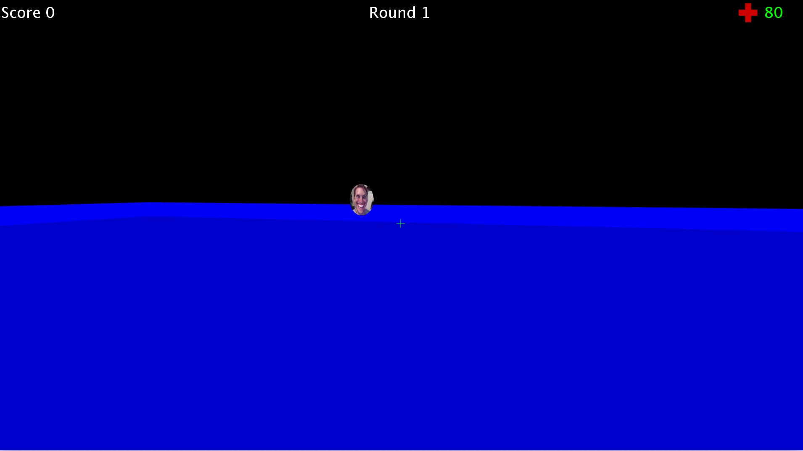

# Shoot The Bad Man

A simple 3D FPS game created for my Grade 11 Computer Science class. Written 
completely in Processing. Complete with sound and projectiles. Round based
survival, like Call of Duty Zombies. Survive as long as you can but beware,
your enemies will grow stronger as the rounds progress. Visuals loosely 
inspired by Among Us, the greatest game to grace the Earth. Made during 
a fever dream.

# Libraries

* [QueasyCam](https://github.com/jrc03c/queasycam) - for FPS camera
* [Sound](https://github.com/processing/processing-sound) - Official Processing libary
  for sound

# Screenshot

